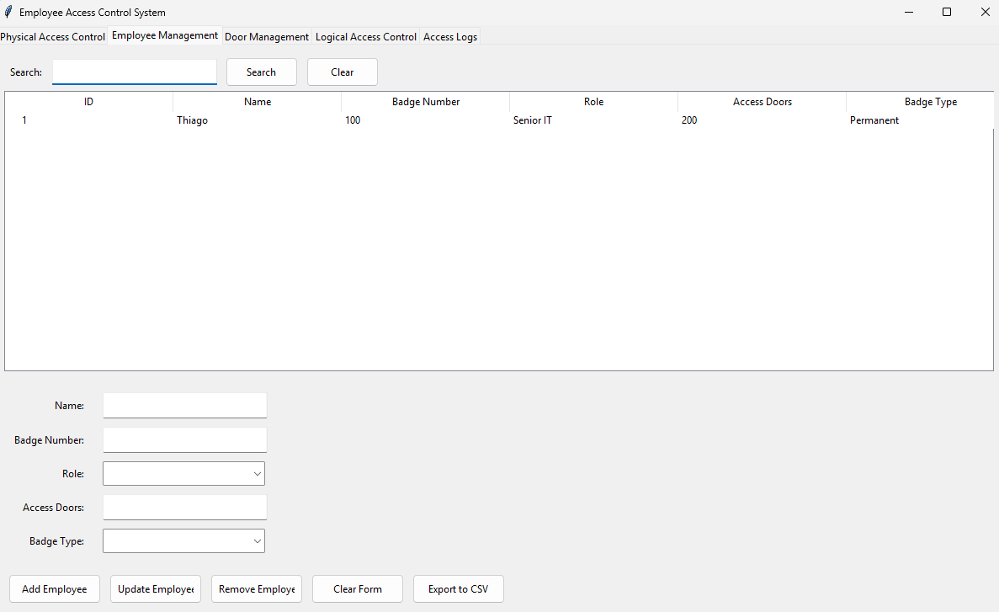
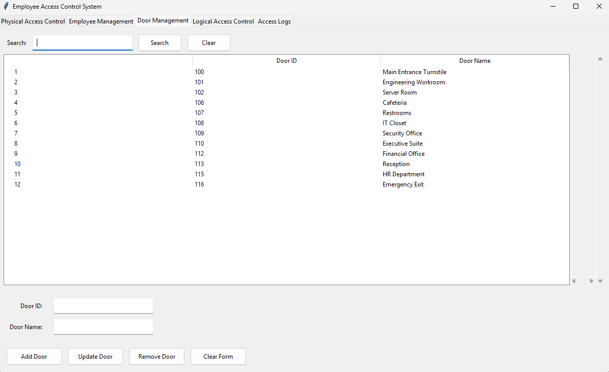
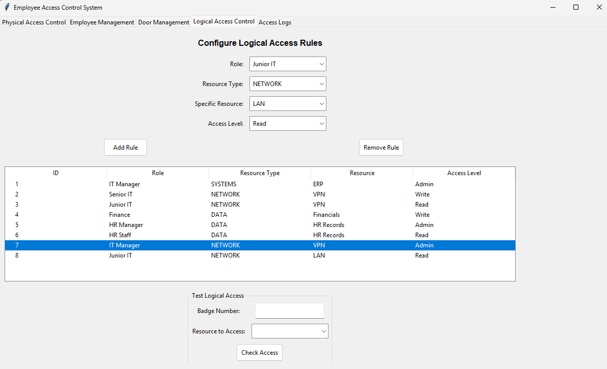
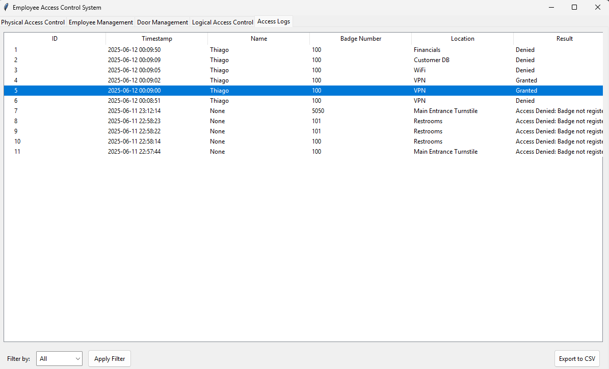
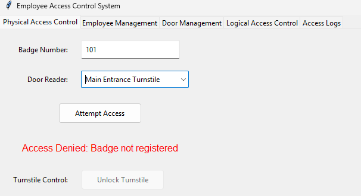

# Employee Access Control System

## Overview

This Python application provides a comprehensive solution for managing both physical and logical access control within an organization. The system helps administrators regulate who can access specific physical locations (like offices and secure areas) and digital resources (such as systems, networks, and sensitive data).

###  Access Control Print Screen - Physical and Logical 

<table>
  <tr>
    <td></td>
    <td></td>
    <td></td>
    <td></td>
    <td></td>
  </tr>
  <tr>
    <td style="text-align: center;">1- Physical Access Control  </td>
    <td style="text-align: center;">2- Door Management</td>
    <td style="text-align: center;">3- Logical Access Control</td>
    <td style="text-align: center;">4- Access Logs</td>
    <td style="text-align: center;">5- Badge Reader (Simulation)</td>
  </tr>
</table>

## Key Features - with data export functionality (CSV)

### Physical Access Control
- Manages access to physical locations (doors, turnstiles, secure areas)
- Tracks employee badge access attempts (granted/denied)
- Supports temporary (24-hour) and permanent badge types
- Provides turnstile control for main entrances

### Logical Access Control
- Controls access to digital resources (systems, networks, databases)
- Implements role-based access control (RBAC)
- Supports different permission levels (Read, Write, Admin)
- Tracks all logical access attempts

### Management Capabilities
- Employee management (add/remove/update)
- Door/access point configuration
- Access rule configuration
- Comprehensive logging and reporting
- ### Data export functionality (CSV)

## Technical Details

- Built with Python 3 and Tkinter for the GUI
- Uses JSON for data persistence
- Modular design with tabbed interface
- Responsive layout for easy administration

## Installation

1. Ensure Python 3.x is installed on your system
2. Clone this repository or download the source files
3. Run the application with: `python mainlogical.py`

## Usage

The application features an intuitive tabbed interface:

1. **Physical Access Control Tab**: Simulate badge scans and door access attempts
2. **Employee Management Tab**: Add, edit, and remove employee records
3. **Door Management Tab**: Configure physical access points
4. **Logical Access Control Tab**: Set up digital resource permissions
5. **Access Logs Tab**: Review all access attempts (physical and logical)

## Access Control Concepts

This system implements two fundamental types of access control:

### Physical Access Control
Restricts entry to physical spaces like buildings, rooms, and secured areas. The system validates employee badges against configured door permissions to grant or deny access.

### Logical Access Control
Limits connections to computer networks, system files, and sensitive data. The system uses role-based rules to determine what digital resources each employee can access and at what permission level.

## Compliance Note

The system's dual approach to access control helps organizations meet various compliance requirements by providing:
- Clear audit trails for both physical and digital access
- Role-based permission structures
- Temporary access capabilities
- Comprehensive logging of all access attempts

## Support

For any questions or issues, please open an issue in this repository.

## Future implementation

I will change some of the featurtes in next months:

* The name of tab Employee Management to Physical Access Control.
* Actual logs are for Physical Access and Logical Access but not for the creation of rules - I will implement that too.
   
## Contact: 

🤵🏽[in/thiago-cequeira-99202239](https://www.linkedin.com/in/thiago-cequeira-99202239/) \
🤗https://huggingface.co/settings/profile
